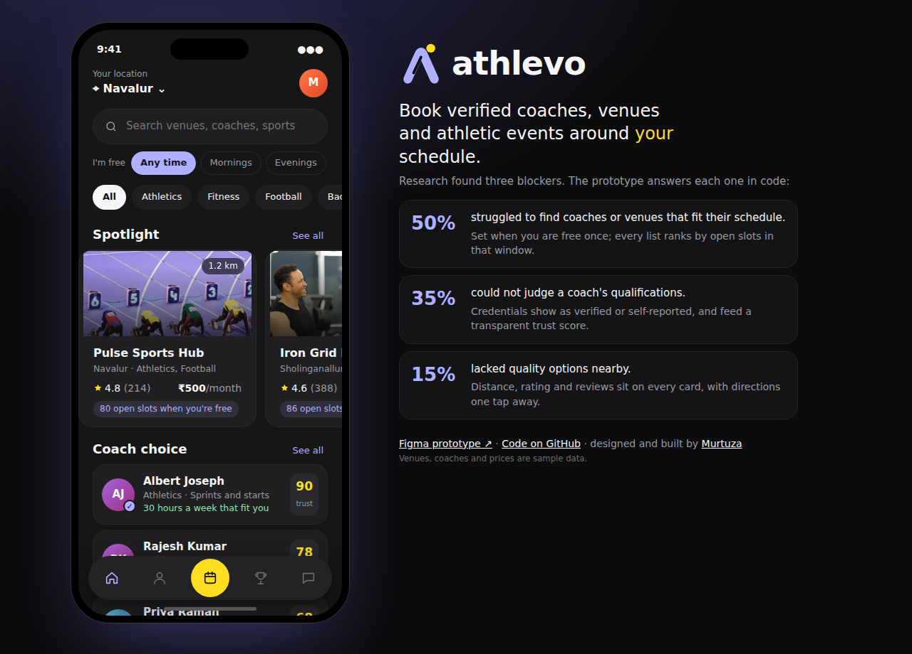
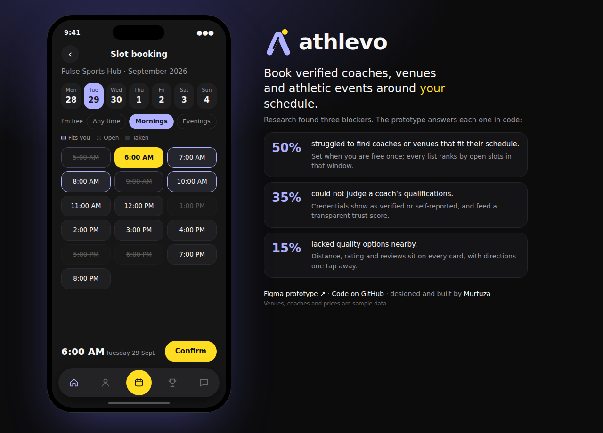
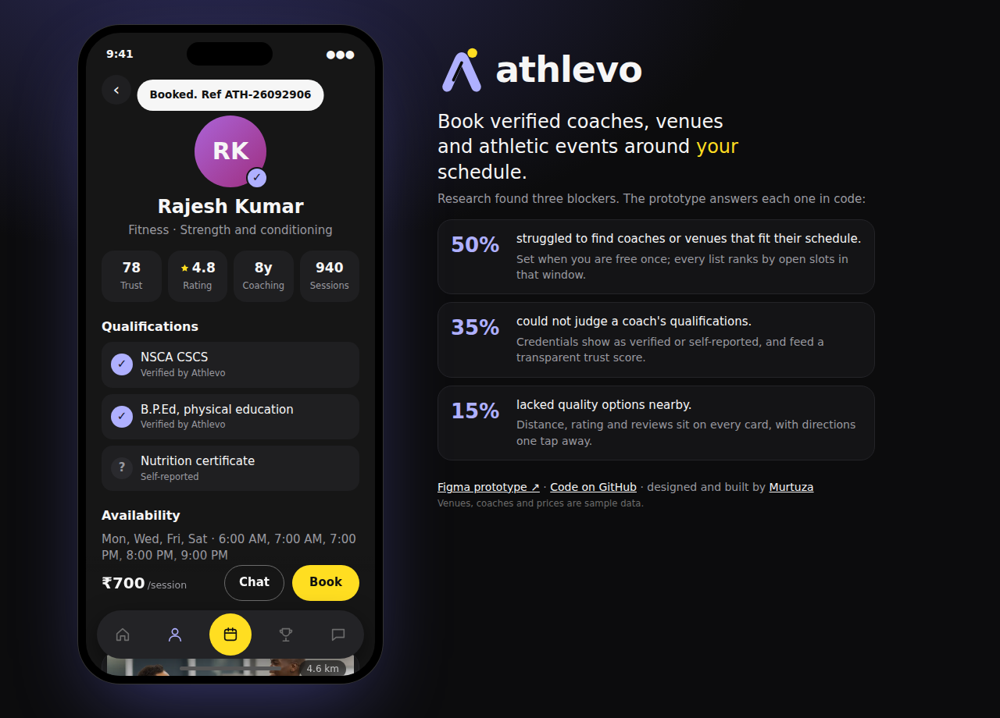
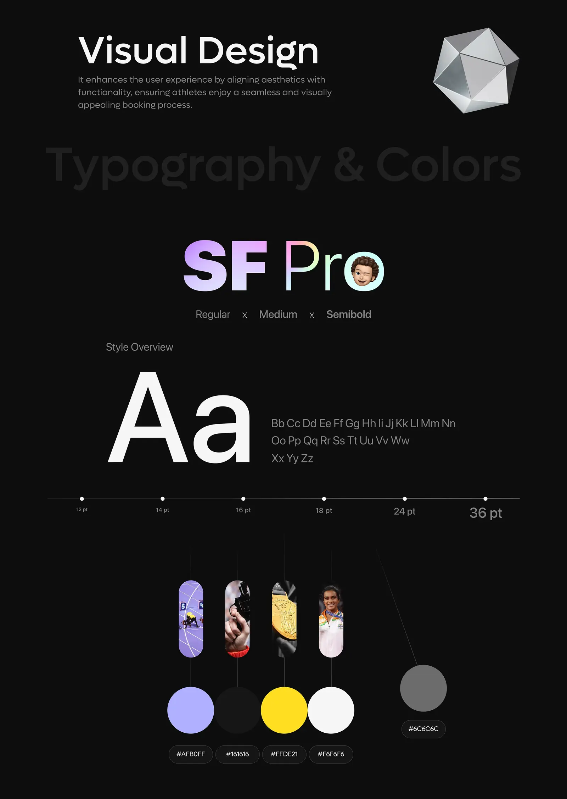
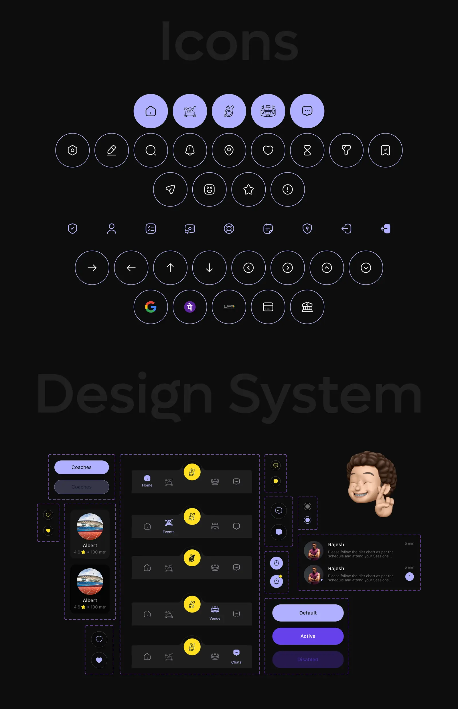
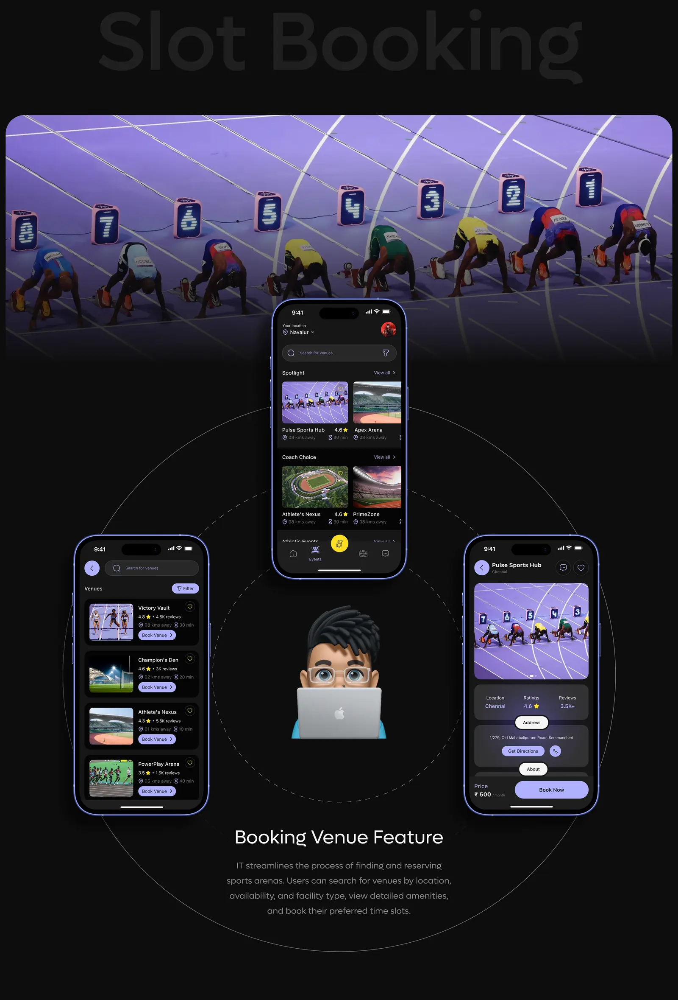
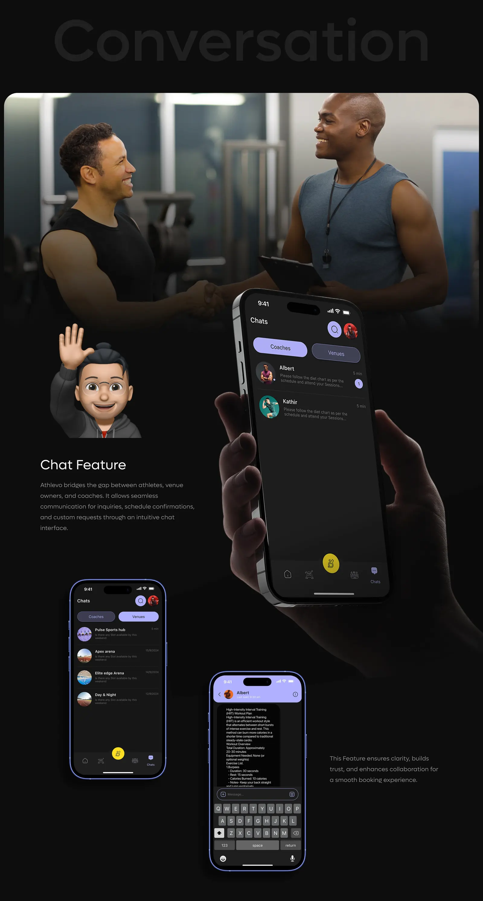
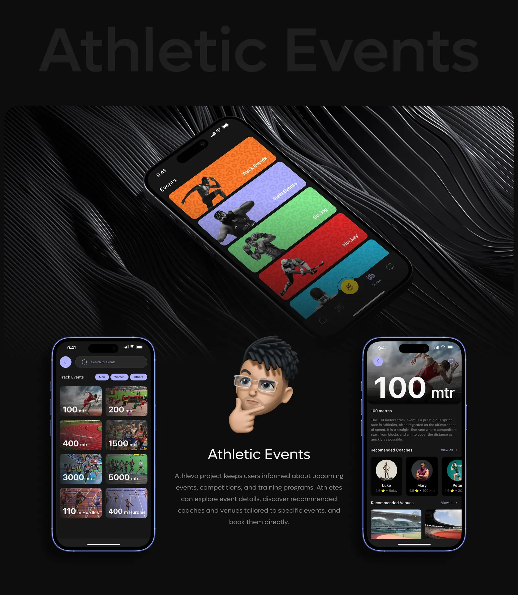

# Athlevo

**Book verified coaches, venues and athletic events around your schedule.** Athlevo is a platform for athletes that makes the hard part, finding the right coach or venue at a time that works, take one tap instead of ten calls. This repo is the coded, clickable prototype of the Athlevo UX/UI case study, built on its design system.

**[Open the coded prototype →](https://murtuzabuilds.github.io/athlevo/)** &nbsp;·&nbsp; **[Figma prototype ↗](https://www.figma.com/proto/2yqeng4JQIHd8AiLudau7k/Athlevo-Application?content-scaling=fixed&kind=proto&node-id=717-9111&page-id=717%3A8048&scaling=scale-down&starting-point-node-id=717%3A9388)**



## Research to product

Research across three audience segments, ages 16 to 50, surfaced three blockers. Each one became a rule in code:

| Finding | Product answer | Where it lives |
|---|---|---|
| **50%** struggled to find coaches or venues that fit their schedule | Tell Athlevo once when you are free (mornings, evenings, weekends). Venues rank by open slots inside that window; coaches rank by overlapping hours; the slot grid highlights times that fit you | `fits`, `openInWindow`, `rankVenues`, `rankCoaches` |
| **35%** could not judge a coach's qualifications | Every credential is marked **verified** or **self-reported**. A transparent trust score weighs verified credentials, years coaching, rating and sessions delivered; unverified claims count against it | `trust`, `verified` |
| **15%** lacked quality options nearby | Distance, rating and review count on every card, plus directions one tap away | `rankVenues`, `directions` |

The Figma prototype was validated with **30 Maze responses: 90% task success booking a coach, 100% booking a venue and viewing events.** This build keeps those flows exactly and makes them work for real.

## What works

| Flow | In the prototype |
|---|---|
| **Home** | Location, search across venues, coaches and sports, sport filters, Spotlight venues, Coach choice, Athletic events |
| **Venue** | Ratings, reviews, amenities, coaches who train there, Get directions (opens Maps), price, Book now |
| **Slot booking** | 7-day date strip, hourly slots with taken and past states, your free window highlighted, double booking refused, booking reference issued |
| **Coaches** | Trust score, credential verification, weekly availability against yours, chat, book |
| **Events** | 100m to 5000m meets, clinics and community runs; register and cancel |
| **Chat** | Coach threads with context-aware replies about fees and times |
| **My bookings** | Everything you booked or registered for, saved on your device |



## Run it

```bash
npm test      # 7 tests, no dependencies
npx serve .   # or any static server
```

## The engine

`src/booking.js` holds the product logic as small pure functions, so every rule is readable and tested:

```js
trust(coach)               // 0 to 100: verified creds, years, rating, sessions; self-reported claims cost points
rankVenues(venues, { sport, window, q })   // schedule fit first, then rating, then distance
book(booked, venue, slot)  // immutable; refuses past or taken slots, returns a booking ref
```



## Design system

| Token | Value | Use |
|---|---|---|
| Lavender | `#AFB0FF` | Primary, active states, logo |
| Ink | `#161616` | App background |
| Volt | `#FFDE21` | Primary action, centre nav |
| Paper | `#F6F6F6` | Text |
| Grey | `#6C6C6C` | Secondary, inactive |
| Type | SF Pro (UI), DM Sans (brand) | |

Tokens live in `tokens/design-tokens.json` (W3C format) and compile to `tokens/tokens.css`.

## Case study

| | |
|---|---|
|  |  |
|  |  |
|  |  |

---

Venues, coaches, events and prices in the prototype are sample data. Research, design and code by [Murtuza](https://github.com/murtuzabuilds). MIT licensed.
